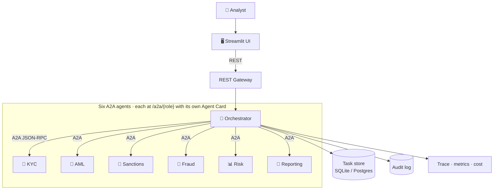
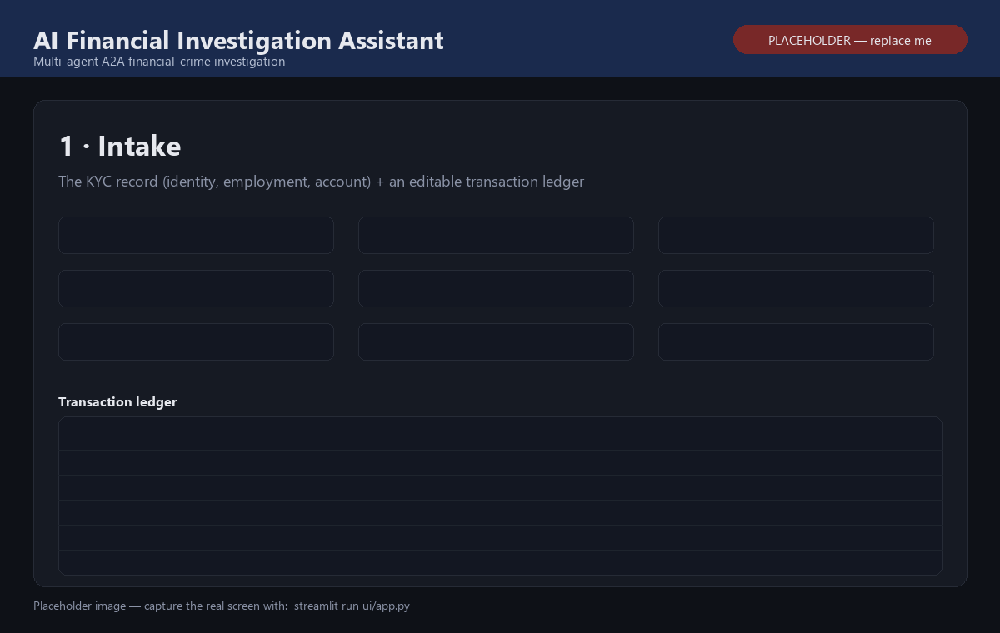
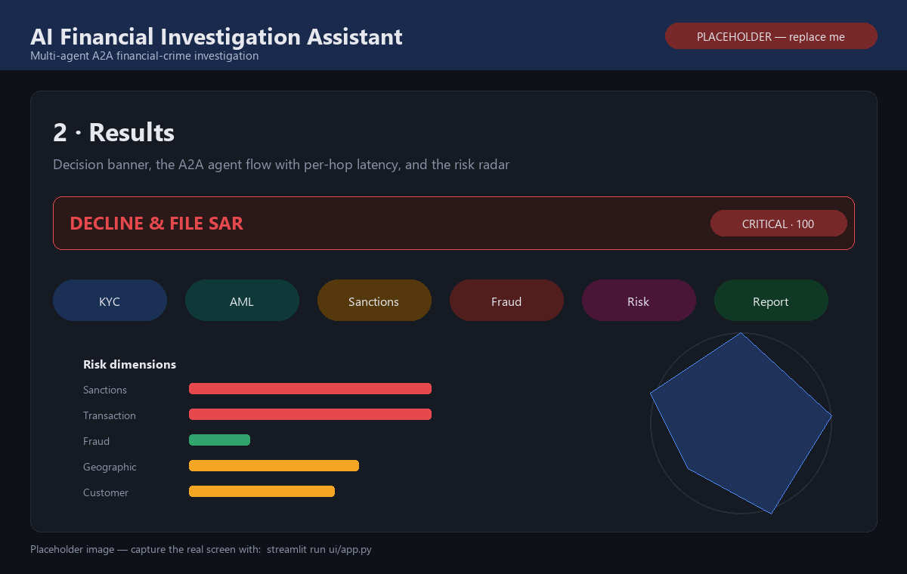
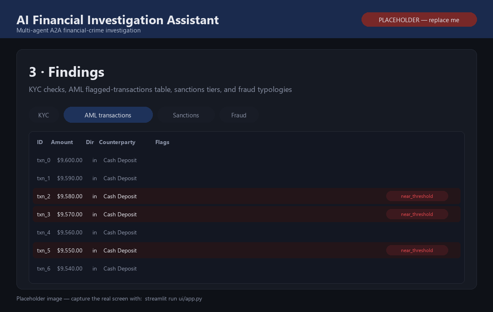
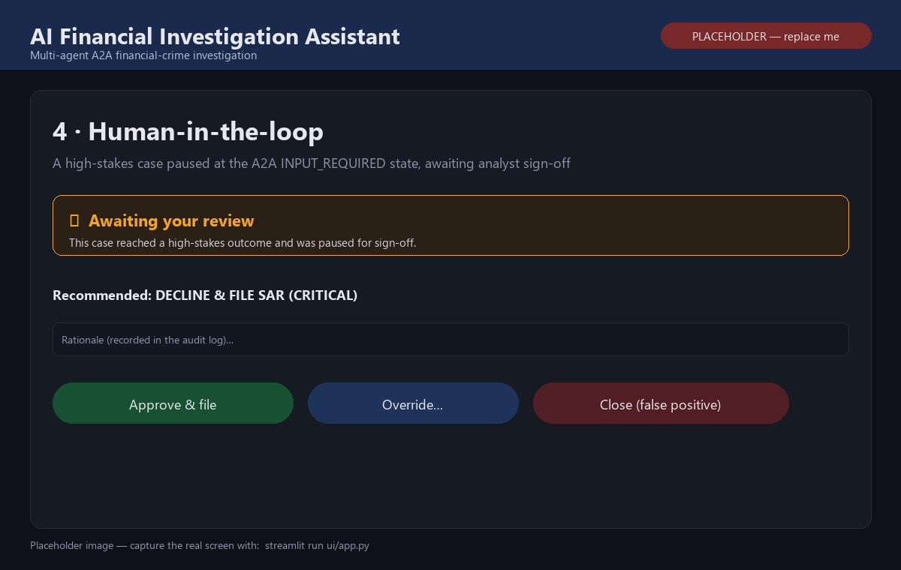

# 🕵️ AI Financial Investigation Assistant

A multi-agent **financial-crime investigation** system built on the
**[Agent2Agent (A2A) protocol, v1.0](https://a2a-protocol.org/)**. An analyst
enters a customer; an **Orchestrator** delegates over real A2A to specialist
agents; out comes a scored, explainable report with a recommended decision.

```
Analyst → UI → Orchestrator →(A2A)→ KYC · AML · Sanctions · Fraud · Risk → Reporting → Report
```

Runs with **no external services and no API key** (fully deterministic), or with
Postgres + an optional LLM narrative when you want them.

---

## Architecture



The UI only ever calls REST; every hop **between** agents is a real A2A JSON-RPC
call over HTTP, sharing one `contextId`. All agents run in one FastAPI process —
splitting them into separate containers is just a change of URLs.
More detail: [`docs/architecture.md`](docs/architecture.md).

---

## The agents

| Agent | Does |
|---|---|
| 🧭 **Orchestrator** | Plans the investigation, delegates over A2A, aggregates results |
| 🪪 **KYC** | Identity & document checks, PEP screening, data-quality, industry/PEP/geographic risk |
| 💸 **AML** | Structuring, layering, cash/crypto intensity — analysed on the real transaction ledger |
| 🚫 **Sanctions** | Fuzzy name matching (Jaro-Winkler) with STRONG / POSSIBLE / NONE tiers |
| 🎣 **Fraud** | Account-takeover, card-testing, scam/new-payee, mule dispersal |
| 📊 **Risk** | Blends five risk dimensions into a transparent score + confidence + decision |
| 📝 **Reporting** | Writes the final report + recommended actions |

---

## What it demonstrates

**A2A protocol (v1.0)** — Agent Cards + discovery (`/.well-known/agent-card.json`),
JSON-RPC methods (`SendMessage`, `GetTask`, `CancelTask`, streaming via SSE),
Tasks & lifecycle, Messages/Parts, Artifacts, shared Context, the official error
codes, `A2A-Version` negotiation, and signed Agent Cards. Wire format is
spec-exact. *(Official-vs-ours ledger: [`docs/a2a-spec-mapping.md`](docs/a2a-spec-mapping.md).)*

**Security** — JWT authentication + RBAC least-privilege (a specialist token can
call nobody), signed cards + peer allowlist, rate limiting, input validation,
prompt-injection guard, secret redaction, and a hash-chained (tamper-evident)
audit log.

**Human-in-the-loop & reliability** — high-stakes cases (HIGH/CRITICAL, SAR, or a
sanctions hit) pause at the A2A `INPUT_REQUIRED` state for an analyst to
**approve / override / close** before anything is filed; plus timeouts, retries
with backoff, loop caps, and an honest `FAILED` (never a misleading "clean"
result) when a step breaks.

**Observability** — a per-investigation trace (latency · tokens · cost · errors),
counters + latency percentiles at `/metrics`, and structured JSON logs.

**Evaluation** — a deterministic harness scoring the system on six dimensions
(task success · routing · quality · consistency · latency · cost), gating at 80%.

---

## Run it

**Docker (API + UI + Postgres):**
```bash
docker compose up --build
```
UI → http://localhost:8501 · API → http://localhost:8000

**Local (SQLite, no external services):**
```bash
pip install -r requirements.txt
uvicorn app.main:app --port 8000
```
```bash
API_BASE_URL=http://localhost:8000 streamlit run ui/app.py
```

**From the terminal:**
```bash
curl -s -X POST http://localhost:8000/investigations -H "Content-Type: application/json" -d '{"profile":{"full_name":"Viktor Petrov","country":"Russia","notes":"cash just under threshold; rapid transfers","id_document":{"number":"RU8837261"}}}'
```

**Tests & evaluation:**
```bash
pytest -q
```
```bash
python -m app.evaluation
```

---

## Example

Input: *Viktor Petrov, Russia, "cash just under threshold; rapid transfers".*

```
Decision:   DECLINE & FILE SAR
Risk score: 100/100 (CRITICAL)   Confidence: HIGH   SAR: YES

Top drivers: sanctions hit (+45) · structuring (+20) · PEP (+15) ·
             rapid movement (+12) · high-risk residence (+10)
```

Every point of the score traces to a named factor.

---

## The UI

A dark, analyst-oriented **case file** (Streamlit): a full KYC intake form + an
editable transaction ledger, then a results view with the **decision banner**,
the **A2A flow** (per-hop latency), a **five-dimension risk radar** + transparent
score breakdown, **findings tabs** (KYC · AML flagged transactions · Sanctions ·
Fraud), a recommended-actions checklist, the downloadable report, case history,
and a live metrics dashboard.

---

## Screenshots

> Drop four PNGs into [`docs/screenshots/`](docs/screenshots/) (see the
> [capture guide](docs/screenshots/CAPTURE_GUIDE.md)) and this grid renders.

<table>
  <tr>
    <td width="50%" valign="top">
      
      <br><sub><b>1 · Intake</b> — the KYC record + editable transaction ledger.</sub>
    </td>
    <td width="50%" valign="top">
      
      <br><sub><b>2 · Results</b> — decision banner, A2A flow, and the risk radar.</sub>
    </td>
  </tr>
  <tr>
    <td width="50%" valign="top">
      
      <br><sub><b>3 · Findings</b> — flagged transactions, sanctions tiers, fraud.</sub>
    </td>
    <td width="50%" valign="top">
      
      <br><sub><b>4 · Human-in-the-loop</b> — a paused case awaiting analyst sign-off.</sub>
    </td>
  </tr>
</table>

---

## Project layout

```
app/
  a2a/            # A2A v1.0 protocol core (reusable, finance-agnostic)
  agents/         # the six agents + cards + schemas
  security/       # JWT, RBAC, signing, validation, rate limit, prompt guard, audit
  tools/          # KYC/AML/sanctions/fraud tools + least-privilege registry
  database/       # SQLAlchemy models, SQLite/Postgres store
  observability/  # logging, trace, metrics, cost
  evaluation/     # scenarios, evaluators, runner
  api/            # FastAPI factory + REST routes
ui/               # Streamlit app
tests/            # 54 tests
docs/             # architecture.md · a2a-spec-mapping.md
```

---

## Scope

Built on the A2A v1.0 spec as the source of truth. Deliberately omitted (not
needed here): push-notification configs, the gRPC binding, and multi-tenancy.
The finance domain, risk model, security, observability, evaluation and UI are
implementation choices — the honest ledger is in
[`docs/a2a-spec-mapping.md`](docs/a2a-spec-mapping.md).

*Portfolio project. The financial data and sanctions/PEP lists are entirely fictional.*
