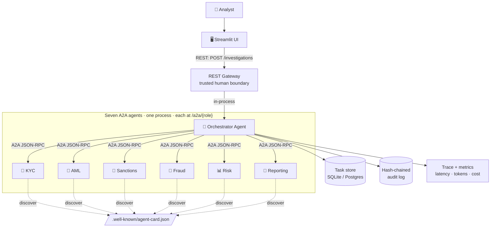
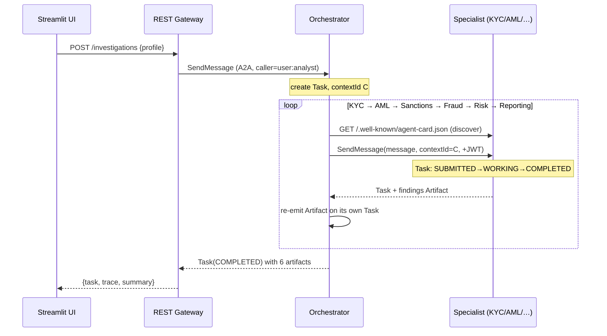

# 🕵️ AI Financial Investigation Assistant — Multi-Agent A2A System

A production-oriented **portfolio project** that runs a realistic financial-crime
investigation using **seven specialized AI agents that collaborate over the
[Agent2Agent (A2A) protocol, v1.0](https://a2a-protocol.org/)**.

> An analyst enters a customer scenario → the **Orchestrator** delegates over A2A
> to **KYC · AML · Sanctions · Fraud · Risk · Reporting** agents → out comes a scored,
> explainable investigation report with a recommended decision.

It's deliberately **small enough for one developer to explain end-to-end in an
interview**, but technically strong: real A2A wire format, JWT auth + RBAC,
signed agent cards, an audit log, per-agent tracing, an evaluation harness, and
a polished Streamlit UI.

**Runs with zero external services and no API key** (fully deterministic), or with
Postgres + LLM narrative when you want them.

---

## Table of contents
- [Overview](#overview)
- [Architecture](#architecture)
- [A2A workflow](#a2a-workflow)
- [The seven agents](#the-seven-agents)
- [A2A concepts implemented](#a2a-concepts-implemented-official-vs-ours)
- [Security](#security-authentication--authorization)
- [Observability](#observability)
- [Reliability](#reliability)
- [Evaluation](#evaluation)
- [How to run](#how-to-run)
- [Example investigation](#example-investigation)
- [The UI](#the-ui)
- [Project structure](#project-structure)
- [Testing](#testing)
- [Interview talking points](#interview-talking-points)
- [Honest scope: official A2A vs our choices](#honest-scope-official-a2a-vs-our-choices)

---

## Overview

Financial institutions must screen customers for **money laundering, sanctions
exposure and fraud**. That work naturally splits across specialists — which makes
it a perfect showcase for **agent-to-agent collaboration**: one coordinator agent
delegating to independent specialist agents, each with its own identity,
capabilities and least-privilege permissions.

This project implements exactly that, using A2A as the **inter-agent protocol**
(not a bespoke RPC). Every hop between agents is a real A2A JSON-RPC call over
HTTP, with Agent Cards, Tasks, Messages/Parts, Artifacts and a shared Context.

**Source of truth:** the current A2A v1.0 specification and its Protocol Buffer
definition. Where we simplify or make our own choices, it's called out explicitly
(see [Honest scope](#honest-scope-official-a2a-vs-our-choices) and
[`docs/a2a-spec-mapping.md`](docs/a2a-spec-mapping.md)).

---

## Architecture



- **UI → REST → A2A** is a strict one-way boundary. The UI never speaks JSON-RPC.
- All seven agents run in **one FastAPI process** (portfolio scale), each mounted at
  `/a2a/{role}` with its **own Agent Card** and JSON-RPC endpoint. Splitting into
  seven containers later is just a change of peer URLs — no code change.

---

## A2A workflow



The single **`contextId`** threads the entire investigation — every specialist
task shares it, which is what makes the trace and the "one case" view line up.

---

## The seven agents

| Agent | Role | What it does | Tools (least privilege) |
|---|---|---|---|
| 🧭 **Orchestrator** | Coordinator | Plans the investigation, delegates over A2A, aggregates artifacts, enforces reliability rails | — (calls other agents) |
| 🪪 **KYC** | Know Your Customer | Identity/document verification, PEP screening, data-quality score | `verify_identity`, `screen_pep` |
| 💸 **AML** | Anti-Money-Laundering | Structuring, layering, cash/crypto intensity, high-risk counterparties — per-transaction detail | `analyze_transactions` |
| 🚫 **Sanctions** | Screening | Jaro-Winkler name matching with **STRONG / POSSIBLE / NONE** tiers; blocked-country check | `screen_sanctions` |
| 🎣 **Fraud** | Fraud detection | Theft/deception typologies: account-takeover, card-testing, scam/new-payee transfers, mule dispersal | `detect_fraud` |
| 📊 **Risk** | Scoring | Blends five risk dimensions into a transparent score + **confidence** + decision | — (aggregation only) |
| 📝 **Reporting** | Report | Composes the final report + structured summary (optional LLM narrative) | — |

Each agent is an `AgentExecutor` (the pattern from the official A2A SDK): it
publishes status/artifact **events** rather than returning a value, so the exact
same agent code works for both non-streaming and streaming (SSE) calls.

---

## A2A concepts implemented (official vs ours)

| A2A concept | Implemented | Where |
|---|---|---|
| **Agent Card** | ✅ | `app/a2a/agent_card.py`, `app/agents/cards.py` |
| **Agent discovery** | ✅ `GET /.well-known/agent-card.json` | `app/a2a/client.py::discover` |
| **JSON-RPC methods** | ✅ `SendMessage`, `SendStreamingMessage`, `GetTask`, `CancelTask` (+ v0.3 aliases) | `app/a2a/server.py` |
| **Messages / Parts** | ✅ text + structured `data` parts | `app/a2a/types.py` |
| **Tasks + lifecycle** | ✅ `SUBMITTED→WORKING→COMPLETED/FAILED/…` with enforced transitions | `app/a2a/task_store.py` |
| **Human-in-the-loop** | ✅ high-stakes cases pause at `TASK_STATE_INPUT_REQUIRED`, resume on an analyst decision (same task/context) | `app/agents/orchestrator.py` |
| **Artifacts** | ✅ each agent's findings | `app/a2a/types.py::Artifact` |
| **Context** | ✅ one shared `contextId` across all agents | orchestrator |
| **Streaming** | ✅ SSE (`SendStreamingMessage`) | `app/a2a/server.py`, `client.py` |
| **Error handling** | ✅ official error codes `-32001…-32009` | `app/a2a/errors.py` |
| **Version negotiation** | ✅ `A2A-Version` header, `VersionNotSupported` (-32009) | `app/a2a/server.py` |
| **Signed Agent Cards** | ✅ JWS-style signature + verify (rogue-agent defense) | `app/security/signing.py` |

**Wire format is spec-exact v1.0** — the two things most tutorials get wrong:
camelCase fields (`contextId`, `mediaType`) and SCREAMING_SNAKE enums
(`TASK_STATE_WORKING`, `ROLE_AGENT`). Pinned by tests.

---

## Security (Authentication ≠ Authorization)

> **Authentication = _who are you?_** → a signed **JWT** proves identity (`sub`).
> **Authorization = _what may you do?_** → the **scopes** in that JWT, checked by RBAC.

| Control | How | File |
|---|---|---|
| **Authentication (JWT)** | Bearer token per call; issuer/audience/expiry validated | `app/security/jwt_auth.py` |
| **Authorization (RBAC / least privilege)** | Scope matrix: orchestrator may invoke specialists, specialists may invoke **nobody**, user may only start an investigation | `app/security/rbac.py` |
| **Secure agent comms** | Mutual auth — the orchestrator mints its **own** token to call each specialist; auth failures are HTTP **401/403** (A2A treats auth as transport-level) | `app/security/authn.py` |
| **Rogue-agent defense** | Signed Agent Cards + a static peer allowlist (only configured URLs are ever called) | `app/security/signing.py` |
| **Input validation** | Part/size limits + Pydantic profile validation | `app/security/validation.py` |
| **Rate limiting** | Token-bucket per client (HTTP middleware) | `app/security/rate_limit.py` |
| **Prompt-injection protection** | Deterministic scoring can't be moved by text; plus injection scan (audited) + sanitizing before any LLM call | `app/security/prompt_guard.py` |
| **Secrets management** | All secrets via env/`SecretStr`; logs **redact** tokens/keys | `app/config.py`, `app/observability/logging.py` |
| **Audit logging** | Append-only, **hash-chained** (tamper-evident) | `app/security/audit.py` |
| **Tool-level least privilege** | The tool registry blocks a role from calling a tool it isn't granted (e.g. Risk can't screen sanctions) | `app/tools/registry.py` |

Least privilege is **structural**: a stolen KYC token can call nobody; a stolen
user token can't call KYC directly (missing `a2a:invoke:kyc`) — both proven by
tests. All controls are settings-driven toggles (`REQUIRE_AGENT_AUTH`,
`REQUIRE_SIGNED_AGENT_CARDS`, `RATE_LIMIT_ENABLED`), **on in docker-compose**.

---

## Observability

Lightweight, dependency-free (no external collector needed):

- **Structured JSON logs** with secret redaction.
- **Per-investigation trace** — one span per A2A hop, keyed by `contextId`,
  capturing **latency · tokens · cost · errors · status**.
- **Metrics** — counters (investigations, A2A calls, errors) + latency
  avg/p50/p95, exposed at `GET /metrics`.
- **Cost/tokens** — real LLM tokens when enabled (0 in deterministic mode) plus
  an honest "estimated tokens" heuristic so the dashboard is meaningful either way.

Everything the UI's trace timeline and KPI cards show comes from this layer.

---

## Reliability

- **Timeouts** on every peer call and on the whole task.
- **Retries with exponential backoff + jitter** — only for transient failures
  (network, 5xx, 429); deterministic 4xx/app errors are never retried.
- **Loop protection** — a delegation-depth guard and a max-iteration cap.
- **Graceful-but-honest degradation** — a failed specialist doesn't crash the run,
  but the investigation is marked **FAILED**, never a misleading "clean" result.
- **Task cancellation** via `CancelTask`.
- **Human-in-the-loop** — a HIGH/CRITICAL, SAR, or sanctions-hit outcome is never
  auto-filed: the task pauses at the A2A `INPUT_REQUIRED` state and waits for an
  analyst to **approve / override / close** (recorded in the audit log) before
  the report is produced. Low-risk cases auto-complete. Toggle with
  `REQUIRE_HUMAN_REVIEW`.

---

## Evaluation

A deterministic eval harness scores the system against labelled scenarios across
**six dimensions**: task success · agent routing · answer quality · factual
consistency · latency · cost.

```bash
python -m app.evaluation
```
```
[PASS] sanctioned_structurer   CRITICAL
[PASS] clean_customer          LOW
[PASS] pep_high_risk_country   MEDIUM
[PASS] layering_ring           HIGH
[PASS] prompt_injection        LOW   (injection did not move the score)
OVERALL PASS RATE: 100% (5/5)   every dimension avg = 1.00
```

The evaluators **discriminate** (they fail on a wrong answer — tested), and the
harness already caught a real scoring bug during development.

---

## How to run

### Option A — Docker (full stack: API + UI + Postgres, security on)

```bash
docker compose up --build
```
- UI  → http://localhost:8501
- API → http://localhost:8000  (`/healthz`, `/metrics`, `/investigations`)

### Option B — Local (SQLite, no external services)

```bash
python -m venv .venv && source .venv/Scripts/activate   # Windows Git Bash
pip install -r requirements.txt

# Terminal 1 — the seven A2A agents + REST gateway
uvicorn app.main:app --port 8000

# Terminal 2 — the UI
API_BASE_URL=http://localhost:8000 streamlit run ui/app.py
```

### Try it from the terminal

```bash
curl -s -X POST http://localhost:8000/investigations \
  -H "Content-Type: application/json" \
  -d '{"profile":{"full_name":"Viktor Petrov","country":"Russia",
       "date_of_birth":"1975-03-11","declared_source_of_funds":"consulting",
       "notes":"cash just under threshold; rapid transfers",
       "id_document":{"number":"RU8837261"}}}'
```

---

## Example investigation

Input: *Viktor Petrov, Russia, "cash just under threshold; rapid transfers".*

Output (abridged):

```
Decision:   DECLINE & FILE SAR
Risk score: 100/100 (CRITICAL)   Confidence: 100/100 (HIGH)   SAR: YES

Score breakdown:
  sanctions_hit            +45   matched Viktor Petrov (RUSSIA-EO14024)
  structuring              +20   9 transactions just under the 10,000 threshold
  pep                      +15   regional governor
  rapid_movement           +12   rapid pass-through of funds
  residence_high_risk      +10   high-risk residence (Russia)
  high_risk_counterparties +10   anonymous wallet, shell corp bvi, …   → capped at 100

Recommended actions:
  ☐ Confirm the sanctions match against the official list and block transactions
  ☐ Freeze onboarding / account activity
  ☐ File a Suspicious Activity Report (SAR)
  ☐ Escalate to the MLRO / compliance immediately
  … (7 total)

A2A trace: kyc 406ms · aml 79ms · sanctions 95ms · risk 92ms · reporting 69ms
```

Every point of the score traces to a named factor — exactly what a compliance
analyst needs to defend a decision.

---

## The UI

A polished, analyst-oriented **case file** (Streamlit). One investigation shows:

- **Decision banner** — headline verdict (`DECLINE & FILE SAR`), band, **confidence bar**, SAR flag.
- **Subject block** — the customer's identity at a glance.
- **A2A communication flow** — the agents animate to ✓ with **per-hop latency**.
- **Risk gauge + transparent score breakdown** — see *how* the number was reached.
- **Findings tabs** — KYC field-checks · AML **flagged-transactions table** (drill into the exact suspicious transactions) · Sanctions **match table with tier**.
- **Analyst action checklist**, the full report (with **download**), and the **execution-trace timeline**.
- Plus **Case History** (DB-backed) and a **Live Metrics** dashboard.

> The UI talks only to the REST API, so it can point at any deployment by
> changing one URL.

---

## Project structure

```
app/
  a2a/            # A2A v1.0 protocol core (finance-agnostic, reusable)
  agents/         # the seven agents + cards + schemas + optional LLM
  security/       # JWT, RBAC, signing, validation, rate limit, prompt guard, audit
  tools/          # mock KYC/AML/sanctions tools + least-privilege registry
  database/       # SQLAlchemy models, SQLite/Postgres store, repository
  observability/  # logging, trace, metrics, cost
  evaluation/     # scenarios, evaluators, runner, CLI
  api/            # FastAPI factory + human REST routes
  config.py       # single source of configuration
ui/               # Streamlit app + components (self-contained HTML/SVG)
tests/            # 47 tests across protocol, agents, persistence, security, obs, eval
docs/             # a2a-spec-mapping.md (official vs ours)
Dockerfile · docker-compose.yml · .env.example · requirements.txt
```

---

## Testing

```bash
pytest -q            # 47 tests
python -m app.evaluation   # eval scorecard (gates at 80%)
```

Suites: protocol conformance · agents/tools · persistence + restart replay ·
security (auth/RBAC/signing/audit/injection/rate-limit) · observability · evaluation.

---

## Interview talking points

- **"Same agent code, streaming or not."** Agents publish events to a queue; the
  server drains it either as a final Task or as SSE. That inversion is the core
  design idea.
- **Authentication vs authorization, made concrete.** JWT proves identity; scopes
  decide access. Least privilege is structural — a specialist token can call
  nobody. Auth is transport-level (401/403), per the spec.
- **The evaluation harness caught a real bug** that 42 unit tests missed (clean
  customers scoring MEDIUM) — because `factual_consistency` passed while the
  *findings* were wrong. Great story about why you evaluate, not just test.
- **Trustworthy, transparent scores.** Every risk point maps to a weighted factor,
  with a confidence measure driven by data completeness + corroboration.
- **Honest degradation.** A broken pipeline is marked FAILED, never a misleading
  "clean" result — the safety-critical default for a compliance tool.
- **Human-in-the-loop the *right* way.** Rather than a bespoke pause, I use the
  A2A `INPUT_REQUIRED` lifecycle state: high-stakes cases pause, and the *same*
  task/context resumes when the analyst decides — approve, override or close,
  all audit-logged. Shows I understand the task lifecycle beyond the happy path.
- **Clean layering.** The `app/a2a` protocol layer imports nothing from
  `app/security` or `app/observability`; those are *injected* by the factory.
- **I distinguish the spec from my choices** — see the mapping doc below.

---

## Honest scope: official A2A vs our choices

This project is careful about what is **official A2A** versus an **implementation
choice**. Full field-by-field ledger: [`docs/a2a-spec-mapping.md`](docs/a2a-spec-mapping.md).

In short:
- **Official & implemented:** Agent Card + discovery, JSON-RPC methods (v1.0
  PascalCase + v0.3 aliases), Message/Part/Task/TaskStatus/Artifact, streaming
  events, error codes, `A2A-Version` negotiation, signed cards.
- **Deliberately omitted (not needed for the demo):** push-notification configs,
  the gRPC binding, multi-tenancy, `ListTasks`/`SubscribeToTask` (return
  `UnsupportedOperation`).
- **Our own (not A2A):** the finance domain + risk model, JWT/RBAC scheme, the
  REST gateway, persistence, observability, evaluation and the UI. Signed-card
  canonicalization uses `json.dumps(sort_keys=True)` — a pragmatic stand-in for
  the spec's RFC 8785.

---

*Built as a learning + interview portfolio project. The financial data and
sanctions/PEP lists are entirely fictional.*
